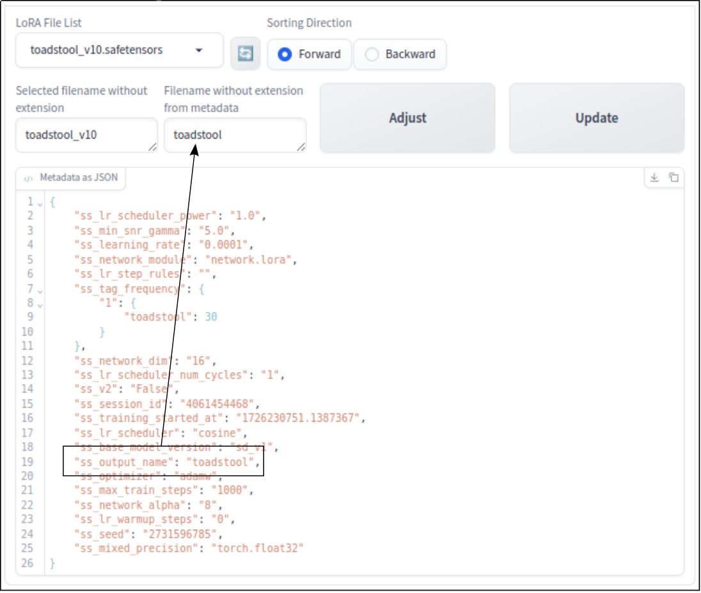

# sd-webui-adjust_lora_filename
#### :arrow_right: Extension for the AUTOMATIC1111 Web UI

<p align="justify"><b>sd-webui-adjust_lora_filename</b> is an <i>Extension</i> for the <a href="https://github.com/AUTOMATIC1111/stable-diffusion-webui">AUTOMATIC1111</a> web UI. The <i>Extension</i> adjusts the <i>file name</i> to the <i>output name</i> in the <i>metadata</i> in a <i>LoRA</i> model file.</p>

---

## Preface

<p align="justify">As I have already written at another places, there is a problem if the LoRA <i>file name</i> without extension is different from the <i>output name</i> in the <i>metadata</i> of the LoRA file itself. The labelling in the LoRa calling expression in a given <i>Prompt</i> can be different from the stored <i>file name</i> without extension. This can be irritating while using a LoRA model. The task of this <i>Extension</i> is to eliminate the difference or discrepancy between the file names.</p>

## Presumptions

<p align="justify">At the moment I am using the web UI <i>AUTOMATIC1111</i> [1] together with the <i>Extension</i> <i>TrainTrain</i> [3] for the LoRA modelling.</p>

## Usage of the LoRA Model

<p align="justify">I explain the former statement using a real live example. Let's say we use following <i>Prompt</i>.</p>

<pre>cat with hat, &lt;lora:FILE_NAME:WEIGHT&gt;</pre>

Normally FILE_NAME is the file name without extension of the file stored on the hard disc or wherever the file may be located. If the output name in the metadata is differnet, selecting a LoRA in AUTOMATIC1111 leads to the following <i>Prompt</i>.

<pre>cat with hat, &lt;lora:OUTPUT_NAME:WEIGHT&gt;</pre>

<p align="justify">If someone is using a lot of LoRA models this behaviour will be confusing.</p>

Typically metadata printed as JSON looks like

<pre>
{
    "ss_base_model_version": "sd_v1",
    "ss_training_started_at": "1726639674.9215708",
    "ss_output_name": "LighthouseConceptLora",
    "ss_optimizer": "adamw",
    "ss_network_dim": "16",
    "ss_tag_frequency": {
        "1": {
            "lighthouse": 12
        }
    },
    "ss_network_module": "network.lora",
    "ss_seed": "1455287774",
    "ss_lr_warmup_steps": "0",
    "ss_lr_step_rules": "",
    "ss_min_snr_gamma": "5.0",
    "ss_lr_scheduler": "cosine",
    "ss_session_id": "3495676067",
    "ss_lr_scheduler_power": "1.0",
    "ss_network_alpha": "8",
    "ss_mixed_precision": "torch.float32",
    "ss_learning_rate": "0.0001",
    "ss_max_train_steps": "1000",
    "ss_lr_scheduler_num_cycles": "1",
    "ss_v2": "False"
}
</pre>  

If I would rename lighthouseconceptlora.safetensors on the harddisk to lighthouseconcept.safetensors on the harddisk in the LoRA model subdirectory, then it happens what I described above. Then there will be a mismatch between lighthouseconceptlora and lighthouseconcept.

## Background

<p align="justify">A <code>.safetensors</code> files consist of a <i>header</i> and a binary part with the tensors. In the <i>header</i> there may be most of the time <i>metadata</i>. One tag of these <i>metadata</i> specifies the output name. If the filename is not changed the output filename is equal to the filename.</p>

## What the Extension Does

<p align="justify">One can select a LoRA file from a dropdown menu. Sorting is possible in alphabetical forward and backward direction. The selected filename without extension is shown in a textbox on the left side. The output filename from the metadata is shown in a textbox on the right side. In parallel the JSON data is shown in textbox underneath. After clicking the Adjust button, the <i>Extension</i> tries to change the metadata tag, which is responsible for the output filename. Afterwards one can check clicking on the Update button, if the operation was successful.</p>

<a target="_blank" href=""></a>

## Installation

The installation link is

```
https://github.com/zentrocdot/sd-webui-adjust_lora_filename
```

## Know Problem

<p align="justify">No problems known yet.</p>

## Spin Off

<p align="justify">I need a extension where I can modify the maximal training steps. At the moment I am performing more training steps then I am using at the end in the final version of the LoRA model. So there will be a mismatch of maximal training steps to the really used training steps.</p>

# Reference

[1] https://github.com/AUTOMATIC1111/stable-diffusion-webui

[2] https://github.com/AUTOMATIC1111/stable-diffusion-webui/wiki/Extensions

[3] https://github.com/hako-mikan/sd-webui-traintrain

<hr width="100%" size="2">

<p align="justify">There are various ways to support my work. One option is to purchase some of my extraordinary NFTs :smiley:. Some of my great collections can be found here:</p>

* https://opensea.io/collection/fantastic-mushroom-collection
* https://opensea.io/collection/cats-with-hats-collection-1
* https://opensea.io/collection/devil-woman-collection
* https://opensea.io/collection/cup-of-ice-no-1

<hr width="100%" size="2">

<p align="center">I loved the time when you could get also a hamburger :hamburger: for one Euro!</p>

<p align="center">
<a target="_blank" href="https://www.buymeacoffee.com/zentrocdot"></a>
</p>
<hr width="100%" size="2">

<p align="justify">If you like what I present here, or if it helps you, or if it is useful, you are welcome to donate a small contribution or a cup of coffee. Or as you might say: Every TRON counts! Many thanks in advance! :smiley:</p>

<pre>TQamF8Q3z63sVFWiXgn2pzpWyhkQJhRtW7            (TRON)
DMh7EXf7XbibFFsqaAetdQQ77Zb5TVCXiX            (DOGE)
12JsKesep3yuDpmrcXCxXu7EQJkRaAvsc5            (BITCOIN)
0x31042e2F3AE241093e0387b41C6910B11d94f7ec    (Ethereum)</pre>
